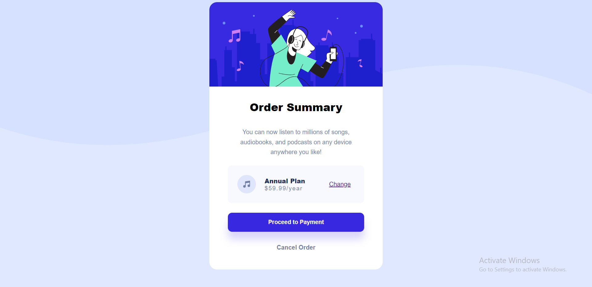

## Table of contents

- [Overview](#overview)
  - [Screenshot](#screenshot)
  - [Links](#links)
- [My process](#my-process)
  - [Built with](#built-with)
  - [What I learned](#what-i-learned)
- [Author](#author)

## Overview

### Screenshot

### Links

- Solution URL: [GitHub](https://github.com/gabadadzeluca/order-summary-component)
- Live Site URL: [Live Site](https://gabadadzeluca.github.io/order-summary-component/)

## My process

### Built with

- Semantic HTML5 markup
- CSS custom properties
- Flex

### What I learned

I learned using flex and managed to make my work much easier. I used flex, text-align, justify-content, align-items properties. Also, scaled an element to change it's size.

### Continued development
 
I should focus on using the right and useful tags in html, discovering new ways to style them in css.

## Author

- LinkedIn - [Luca Gabadadze](https://www.linkedin.com/in/luca-gabadadze-6068b324a/)

